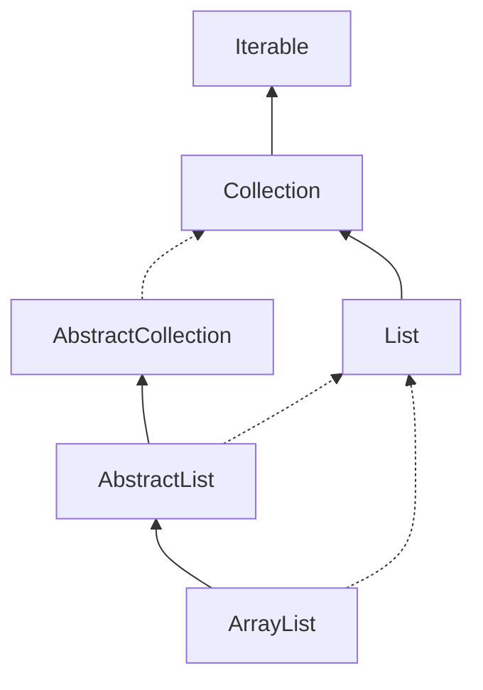

```java
/**
 * Resizable-array implementation of the List interface.  
 * 可调整大小的数组的List的实现
 * 
 * Implements all optional list operations, and permits all elements, including null.  
 * 实现了所有可选的List操作，以及允许任何元素，包括null。
 * 
 * In addition to implementing the List interface, this class provides methods to manipulate the size of the array that is used internally to store the list.  
 * 除了实现List接口外，这个类还提供了一些方法来操作内部用于存储列表的数组的大小。
 * (This class is roughly equivalent to Vector, except that it is unsynchronized.)
 * 这个类大致相当于Vector，只是它是不同步的
 *
 * The size, isEmpty, get, set, iterator, and listIterator operations run in constant time.  
 * size、isEmpty、get、set、迭代器和listIterator操作以恒定时间运行。
 * 
 * The add operation runs in amortized constant time, that is, adding n elements requires O(n) time.  
 * add操作需要O(n)的时间，其中n是添加的元素的数量。
 * 
 * All of the other operations run in linear time (roughly speaking).  
 * 其他操作以线性时间运行（近似地）。
 * 
 * The constant factor is low compared to that for the LinkedList implementation.
 * 这个常数因子与LinkedList实现相比要低得多。
 * 
 *
 * Each ArrayList instance has a capacity.  
 * 每个ArrayList实例都有一个容量。
 * 
 * The capacity is the size of the array used to store the elements in the list. 
 * 这个capacity是存储列表中元素的数组的大小。
 * 
 * It is always at least as large as the list size.  
 * 容量至少是列表的大小。
 * 
 * As elements are added to an ArrayList, its capacity grows automatically.  
 * 当元素添加到ArrayList时，它的容量会自动增长。
 * 
 * The details of the growth policy are not specified beyond the fact that adding an element has constant amortized time cost.
 * 除了增加一个要素具有恒定的摊余时间成本这一事实之外，没有具体说明增长政策的细节。
 * 
 * An application can increase the capacity of an ArrayList instance before adding a large number of elements using the ensureCapacity operation.  
 * 应用程序可以使用ensureCapacity操作在添加大量元素之前增加ArrayList实例的容量。
 * 
 * This may reduce the amount of incremental reallocation.
 * 这可能减少增量重新分配。
 *
 * Note that this implementation is not synchronized.
 * 这个实现不是线程安全的。
 * 
 * If multiple threads access an ArrayList instance concurrently,
 * and at least one of the threads modifies the list structurally, it
 * must be synchronized externally.  
 * 如果多个线程同时访问一个ArrayList实例，并且至少有一个线程修改了列表的结构，那么它必须在外部同步。
 * 
 * (A structural modification is
 * any operation that adds or deletes one or more elements, or explicitly
 * resizes the backing array; merely setting the value of an element is not
 * a structural modification.)  
 * 结构修改指的是任何操作，添加或删除一个或多个元素，或修改了数组的大小；仅仅修改了集合中元素的值不是结构修改。
 * 
 * This is typically accomplished by synchronizing on some object that naturally encapsulates the list.
 * 通常操作是将列表包装在某些对象上，以确保在外部进行同步。
 *
 * If no such object exists, the list should be "wrapped" using the {@link Collections#synchronizedList Collections.synchronizedList} method. 
 * 如果不存在这样的对象，则应使用 ｛@linkCollections#synchronizedListCollections.synchronizedList｝方法。 
 * This is best done at creation time, to prevent accidental unsynchronized access to the list:
 * 最好在创建时执行此操作，以防止意外地对列表进行不同步的访问：
 * 
 * List list = Collections.synchronizedList(new ArrayList(...));
 *
 * fail-fast快速失败
 * 
 * The iterators returned by this class's {@link #iterator() iterator} and
 * {@link #listIterator(int) listIterator} methods are <em>fail-fast</em>
 * 通过iterator()和listIterator(int)方法返回的迭代器具有“快速失败”特性。
 * 
 * if the list is structurally modified at any time after the iterator is
 * created, in any way except through the iterator's own
 * {@link ListIterator#remove() remove} or
 * {@link ListIterator#add(Object) add} methods, the iterator will throw a
 * {@link ConcurrentModificationException}.  
 * 如果在创建迭代器之后以任何方式（除了通过迭代器自身的remove()或add(Object)方法）对列表进行结构性修改，那么迭代器将会抛出一个ConcurrentModificationException异常。
 * 
 * Thus, in the face of concurrent modification, the iterator fails quickly and cleanly, rather than risking arbitrary, non-deterministic behavior at an undetermined time in the future.
 * 因此，面对并发修改，迭代器会迅速而干净地失败，而不是冒着在未来不确定的时间出现任意、不确定行为的风险。
 *
 * Note that the fail-fast behavior of an iterator cannot be guaranteed
 * as it is, generally speaking, impossible to make any hard guarantees in the
 * presence of unsynchronized concurrent modification.  
 * 无法保证绝对的快速失败：尽管快速失败机制试图在检测到并发修改时立即抛出异常，但在非同步并发修改的情况下，由于线程间的竞态条件等因素，理论上不可能对快速失败行为做出严格的保证。
 * Fail-fast iterators throw {@code ConcurrentModificationException} on a best-effort basis.
 * 尽力而为的原则：快速失败的迭代器会在尽最大努力的基础上抛出ConcurrentModificationException异常。这意味着虽然设计上期望在并发修改发生时能及时发现并抛出异常，但不能确保每次都能准确捕获到所有可能的并发修改情况。
 * 
 * Therefore, it would be wrong to write a program that depended on this
 * exception for its correctness:  the fail-fast behavior of iterators
 * should be used only to detect bugs.
 * 正确使用快速失败机制：开发人员不应依赖于快速失败异常来确保程序逻辑的正确性。也就是说，不应该编写这样的代码：其正常运行的前提是必须抛出ConcurrentModificationException。这是因为快速失败行为并不能作为并发编程中的一种安全机制来使用。
 *
 * This class is a member of the
 * <a href="{@docRoot}/../technotes/guides/collections/index.html">
 * Java Collections Framework</a>.
 *
 * @author  Josh Bloch
 * @author  Neal Gafter
 * @see     Collection
 * @see     List
 * @see     LinkedList
 * @see     Vector
 * @since   1.2
 */

public class ArrayList<E> extends AbstractList<E>
        implements List<E>, RandomAccess, Cloneable, java.io.Serializable
{
    private static final long serialVersionUID = 8683452581122892189L;

    /**
     * Default initial capacity.
     * 默认初始容量
     */
    private static final int DEFAULT_CAPACITY = 10;

    /**
     * Shared empty array instance used for empty instances.
     * 这是共享的空数组实例，用于表示没有任何元素的ArrayList。当ArrayList被创建且未指定初始容量时，并不会立即分配实际的数据存储空间，而是引用这个空数组。
     */
    private static final Object[] EMPTY_ELEMENTDATA = {};

    /**
     * Shared empty array instance used for default sized empty instances.
     * 这也是一个共享的空数组实例，但它专门用于表示默认大小（即初始容量为0）的空ArrayList
     * 
     *  We distinguish this from EMPTY_ELEMENTDATA to know how much to inflate when first element is added.
     * EMPTY_ELEMENTDATA区分的主要目的是为了在扩容时准确知道应该将数组容量扩大到多大
     */
    private static final Object[] DEFAULTCAPACITY_EMPTY_ELEMENTDATA = {};

    /**
     * The array buffer into which the elements of the ArrayList are stored.
     * ArrayList的元素都会存储在这个数组缓冲区中
     * 
     * The capacity of the ArrayList is the length of this array buffer. 
     * 属猪的数组缓冲区的容量就是ArrayList的容量。
     * 
     * Any empty ArrayList with elementData ==  DEFAULTCAPACITY_EMPTY_ELEMENTDATA will be expanded to DEFAULT_CAPACITY when the first element is added.
     * 如果ArrayList为空，并且其内部的 elementData 变量引用的是 DEFAULTCAPACITY_EMPTY_ELEMENTDATA 这个空数组实例，在添加第一个元素时，ArrayList会将其容量自动扩展到默认容量（DEFAULT_CAPACITY）
     * 
     * 说明：
     * transient 关键字表明该字段不会被序列化，即在将对象转换为字节流进行持久化存储或网络传输时，不会包含此字段的数据
     * 通常情况下成员变量会声明为私有（private）以保护其内部状态不被外部直接访问，但在这里故意没有将其设置为私有的原因是便于嵌套类（nested class）访问这个变量
     */
    transient Object[] elementData; // non-private to simplify nested class access
    

    /**
     * The size of the ArrayList (the number of elements it contains).
     * ArrayList的大小（即包含的元素个数）
     *
     * @serial
     */
    private int size;

    /**
     * Constructs an empty list with the specified initial capacity.
     * 构建一个空的ArrayList，指定初始容量
     *
     * @param  initialCapacity  list的初始容量
     * @throws IllegalArgumentException 如果初始容量一个负数抛出异常
     */
    public ArrayList(int initialCapacity) {
        if (initialCapacity > 0) {
            this.elementData = new Object[initialCapacity];
        } else if (initialCapacity == 0) {
            this.elementData = EMPTY_ELEMENTDATA;
        } else {
            throw new IllegalArgumentException("Illegal Capacity: "+
                                               initialCapacity);
        }
    }

    /**
     * Constructs an empty list with an initial capacity of ten.
     * 构建一个空的ArrayList，初始容量为10
     */
    public ArrayList() {
        this.elementData = DEFAULTCAPACITY_EMPTY_ELEMENTDATA;
    }

    /**
     * Constructs a list containing the elements of the specified
     * collection, in the order they are returned by the collection's
     * iterator.
     * 构建一个ArrayList，包含指定集合中的所有元素，按照集合的迭代器返回的顺序
     *
     * @param c 构建list元素的集合
     * @throws NullPointerException 如果目标集合是null，则抛出NullPointerException异常
     */
    public ArrayList(Collection<? extends E> c) {
        elementData = c.toArray();
        if ((size = elementData.length) != 0) {
            // c.toArray might (incorrectly) not return Object[] (see 6260652)
            // Java1.6 以前可能存在c.toArray()不是Object[]的问题https://bugs.java.com/bugdatabase/view_bug.do?bug_id=6260652
            if (elementData.getClass() != Object[].class)
                elementData = Arrays.copyOf(elementData, size, Object[].class);
        } else {
            // replace with empty array.
            this.elementData = EMPTY_ELEMENTDATA;
        }
    }

    /**
     * Trims the capacity of this ArrayList instance to be the list's current size.  
     * 整理容量，将ArrayList的容量调整到当前大小
     * An application can use this operation to minimize the storage of an ArrayList instance.
     * 系统可以使用此方法来最小化ArrayList实例的存储。
     */
    public void trimToSize() {
        // ArrayList被修改的次数
        modCount++;
        // size是当前元素数量，当前元素数量小于底层数据数组(elementData)，则说明有收缩的空间
        if (size < elementData.length) {
            // 当元素为0时，设置为预定的空数组，释放原数组空间，
            // 否则调用Arrays.copyOf方法，将底层数组复制到新数组中，并返回新数组
            elementData = (size == 0)
              ? EMPTY_ELEMENTDATA
              : Arrays.copyOf(elementData, size);
        }
    }

    /**
     * Increases the capacity of this ArrayList instance, if necessary, to ensure that it can hold at least the number of elements specified by the minimum capacity argument.
     * 确保ArrayList的容量至少能容纳minCapacity个元素
     *
     * @param   minCapacity   the desired minimum capacity，所需的最小容量
     */
    public void ensureCapacity(int minCapacity) {
        // 最小扩展容量minExpand
        int minExpand = (elementData != DEFAULTCAPACITY_EMPTY_ELEMENTDATA)
            // any size if not default element table
            // 如果当前不是默认的元素数组，说明ArrayListy已经被初始化，将minExpand设置为0，说明任何大小都进行扩容
            ? 0
            // larger than default for default empty table. It's already supposed to be at default size.
            // 默认的空数组，表明ArrayList还未真正分配过容量，这时minExpand被设置为DEFAULT_CAPACITY，它是ArrayList初始容量的默认值
            : DEFAULT_CAPACITY;
        // 需要的最小容量，大于当前最小扩展容量，则进行扩容
        if (minCapacity > minExpand) {
            ensureExplicitCapacity(minCapacity);
        }
    }

    // 用于计算ArrayList需要的实际容量。
    private static int calculateCapacity(Object[] elementData, int minCapacity) {
        if (elementData == DEFAULTCAPACITY_EMPTY_ELEMENTDATA) {
            return Math.max(DEFAULT_CAPACITY, minCapacity);
        }
        return minCapacity;
    }

    // 调用calculateCapacity方法计算实际需要的容量，并将结果传递给ensureExplicitCapacity方法，触发扩容操作
    private void ensureCapacityInternal(int minCapacity) {
        ensureExplicitCapacity(calculateCapacity(elementData, minCapacity));
    }

    private void ensureExplicitCapacity(int minCapacity) {
        // 集合操作数增加
        modCount++;

        // overflow-conscious code
        // 此处是考虑溢出的情况，详情可以参考使用：minCapacity - elementData.length > 0 对于minCapacity > elementData.length,虽然逻辑上相同
        // 但是在实际计算机中会有溢出的情况，第一种写法可以避免一部分溢出的问题
        if (minCapacity - elementData.length > 0)
            grow(minCapacity);
    }

    /**
     * The maximum size of array to allocate.
     * array的最大值
     * Some VMs reserve some header words in an array.
     * 一些VM在数组中保留一些头信息，
     * 
     * Attempts to allocate larger arrays may result in OutOfMemoryError: Requested array size exceeds VM limit
     * 超过VM限制可能会抛出的OutOfMemoryError: Requested array size exceeds VM limit
     */
    private static final int MAX_ARRAY_SIZE = Integer.MAX_VALUE - 8;

    /**
     * Increases the capacity to ensure that it can hold at least the number of elements specified by the minimum capacity argument.
     * 增加容量，确保至少能容纳minCapacity个元素
     *
     * @param minCapacity the desired minimum capacity
     */
    private void grow(int minCapacity) {
        // overflow-conscious code
        int oldCapacity = elementData.length;
        // 即将现有容量增加1.5倍
        int newCapacity = oldCapacity + (oldCapacity >> 1);
        // 如果新的容量仍不足以满足要求，因此将 newCapacity 直接设置为 minCapacity。
        if (newCapacity - minCapacity < 0)
            newCapacity = minCapacity;

        if (newCapacity - MAX_ARRAY_SIZE > 0)
            // 防止数组容量过大造成整数溢出，调用hugeCapacity(minCapacity) 来处理超大容量的需求，该方法会返回一个合适的最大容量值
            newCapacity = hugeCapacity(minCapacity);
        // minCapacity is usually close to size, so this is a win:
        // minCapacity 往往接近于当前 ArrayList 的大小（size），通过这种方式扩容既能满足未来存储需求，又不会过度分配内存，从而提高了效率
        elementData = Arrays.copyOf(elementData, newCapacity);
    }

    private static int hugeCapacity(int minCapacity) {
        // 整数溢出
        if (minCapacity < 0) // overflow
            throw new OutOfMemoryError();
        return (minCapacity > MAX_ARRAY_SIZE) ?
            // 如果minCapacity大于MAX_ARRAY_SIZE，则返回Integer的最大值Integer.MAX_VALUE，此时vm会抛出OutOfMemoryError: Requested array size exceeds VM limit
            Integer.MAX_VALUE :、
            // 如果minCapacity不大于MAX_ARRAY_SIZE，则直接返回MAX_ARRAY_SIZE作为最大的允许容量值，ArrayList将扩容到这个大小
            MAX_ARRAY_SIZE;
    }

    /**
     * Returns the number of elements in this list.
     * 返回集合中元素的个数
     *
     * @return the number of elements in this list
     */
    public int size() {
        return size;
    }

    /**
     * Returns true if this list contains no elements.
     * 返回true，如果集合中元素个数为0
     *
     * @return true if this list contains no elements
     */
    public boolean isEmpty() {
        return size == 0;
    }

    /**
     * Returns true if this list contains the specified element.
     * 返回true，如果集合中包含指定的元素
     *
     * More formally, returns true if and only if this list contains at least one element e such that (o==null ? e==null : o.equals(e)).
     * 更正式的，如果集合中包含至少一个元素e，满足o==null ? e==null : o.equals(e)，则返回true；
     *
     * @param o element whose presence in this list is to be tested
     * @return true if this list contains the specified element
     */
    public boolean contains(Object o) {
        return indexOf(o) >= 0;
    }

    /**
     * Returns the index of the first occurrence of the specified element in this list, or -1 if this list does not contain the element.
     * 返回索引的第一个出现指定的元素的索引，如果不包含指定的元素，则返回-1
     * 
     * More formally, returns the lowest index i such that (o==null ? get(i)==null : o.equals(get(i))), or -1 if there is no such index.
     * 更正式的，返回满足o==null ? get(i)==null : o.equals(get(i))的最小索引i，如果不存在满足条件的索引，则返回-1
     */
    public int indexOf(Object o) {
        if (o == null) {
            for (int i = 0; i < size; i++)
                if (elementData[i]==null)
                    return i;
        } else {
            for (int i = 0; i < size; i++)
                if (o.equals(elementData[i]))
                    return i;
        }
        return -1;
    }

    /**
     * Returns the index of the last occurrence of the specified element in this list, or -1 if this list does not contain the element.
     * 返回最后一个出现指定的元素的索引，如果不包含指定的元素，则返回-1
     * 
     * More formally, returns the highest index i such that (o==null ? get(i)==null : o.equals(get(i))), or -1 if there is no such index.
     * 更正式的，返回满足o==null ? get(i)==null : o.equals(get(i))的最大索引i，如果不存在满足条件的索引，则返回-1
     */
    public int lastIndexOf(Object o) {
        if (o == null) {
            for (int i = size-1; i >= 0; i--)
                if (elementData[i]==null)
                    return i;
        } else {
            for (int i = size-1; i >= 0; i--)
                if (o.equals(elementData[i]))
                    return i;
        }
        return -1;
    }

    /**
     * Returns a shallow copy of this ArrayList instance.  (The elements themselves are not copied.)
     * 返回一个浅拷贝的ArrayList实例
     *
     * @return a clone of this ArrayList instance 一个克隆的ArrayList实例
     */
    public Object clone() {
        try {
            ArrayList<?> v = (ArrayList<?>) super.clone();
            v.elementData = Arrays.copyOf(elementData, size);
            v.modCount = 0;
            return v;
        } catch (CloneNotSupportedException e) {
            // this shouldn't happen, since we are Cloneable
            // 理论上讲，由于ArrayList实现了Cloneable接口，super.clone()不应该抛出CloneNotSupportedException异常
            throw new InternalError(e);
        }
    }

    /**
     * Returns an array containing all of the elements in this list in proper sequence (from first to last element).
     * 返回一个包含所有元素的数组，该数组的顺序与集合中的元素顺序一致（从第一个元素到最后一个元素）
     *
     * The returned array will be "safe" in that no references to it are maintained by this list.  
     * 这个返回的数组是安全的，不会被该集合所维护
     * 
     * (In other words, this method must allocate a new array).
     * 换句话说，该方法必须分配一个新的数组
     * 
     * The caller is thus free to modify the returned array.
     * 调用者可以自由的修改返回的数组
     *
     * This method acts as bridge between array-based and collection-based APIs.
     * 这个方法充当数组和集合之间的桥梁
     *
     * @return an array containing all of the elements in this list in proper sequence；一个包含所有元素的数组，该数组的顺序与集合中的元素顺序一致（从第一个元素到最后一个元素）
     */
    public Object[] toArray() {
        return Arrays.copyOf(elementData, size);
    }

    /**
     * Returns an array containing all of the elements in this list in proper sequence (from first to last element); 
     * 返回一个包含所有元素的数组，该数组的顺序与集合中的元素顺序一致（从第一个元素到最后一个元素）
     * 
     * the runtime type of the returned array is that of the specified array.  
     * 返回数组的类型与指定的数组相同
     * 
     * If the list fits in the specified array, it is returned therein.  
     * 如果列表适合指定的数组，则返回 therein
     *
     * Otherwise, a new array is allocated with the runtime type of the specified array and the size of this list.
     * 否则，分配一个具有运行时类型的指定的数组和集合大小的新数组
     *
     * If the list fits in the specified array with room to spare
     * 如果列表适合指定的数组，但有剩余空间
     * 
     * (i.e., the array has more elements than the list), 
     * 也就是说，这个数组有剩余空间
     * 
     * the element in the array immediately following the end of the collection is set to null.
     * 这个元素在集合末尾之后被设置为null
     * 
     *  (This is useful in determining the length of the list only if the caller knows that the list does not contain any null elements.)
     * 这个是用来确定集合长度的，如果调用者知道集合不包含任何null元素
     *
     * @param a the array into which the elements of the list are to
     *          be stored, if it is big enough; otherwise, a new array of the
     *          same runtime type is allocated for this purpose.
     * @return an array containing the elements of the list
     * @throws ArrayStoreException if the runtime type of the specified array
     *         is not a supertype of the runtime type of every element in
     *         this list
     * @throws NullPointerException if the specified array is null
     */
    @SuppressWarnings("unchecked")
    public <T> T[] toArray(T[] a) {
        if (a.length < size)
            // Make a new array of a's runtime type, but my contents:
            // 创建一个新的数组，该数组的运行时类型与指定的数组相同，但包含集合中的元素
            return (T[]) Arrays.copyOf(elementData, size, a.getClass());
        System.arraycopy(elementData, 0, a, 0, size);
        if (a.length > size)
            a[size] = null;
        return a;
    }

    // Positional Access Operations
    // 位置访问操作
    @SuppressWarnings("unchecked")
    E elementData(int index) {
        // 取出索引位置的元素
        return (E) elementData[index];
    }

    /**
     * Returns the element at the specified position in this list.
     * 返回集合中指定索引位置的元素
     *
     * @param  index index of the element to return
     * @return the element at the specified position in this list
     * @throws IndexOutOfBoundsException {@inheritDoc}
     */
    public E get(int index) {
        // 判断索引是否越界
        rangeCheck(index);

        // 取出索引位置的元素
        return elementData(index);
    }
    

    /**
     * Replaces the element at the specified position in this list with the specified element.
     * 替换集合中指定索引位置的元素
     *
     * @param index index of the element to replace
     * @param element element to be stored at the specified position
     * @return the element previously at the specified position
     * @throws IndexOutOfBoundsException {@inheritDoc}
     */
    public E set(int index, E element) {
        // 判断索引是否越界
        rangeCheck(index);
        // 获取索引位置的元素
        E oldValue = elementData(index);
        // 替换元素
        elementData[index] = element;
        // 返回旧值
        return oldValue;
    }

    /**
     * Appends the specified element to the end of this list.
     * 添加元素到集合中
     *
     * @param e element to be appended to this list
     * @return true (as specified by {@link Collection#add})
     */
    public boolean add(E e) {
        // 集合的容量增加
        ensureCapacityInternal(size + 1);  // Increments modCount!!
        // 增加元素
        elementData[size++] = e;
        return true;
    }

    /**
     * Inserts the specified element at the specified position in this list.
     * 在此列表中的指定位置插入指定的元素。
     * 
     * Shifts the element currently at that position (if any) and any subsequent elements to the right (adds one to their indices).
     * 将当前位于该位置的元素（如果有）和任何后续元素向右移动（在其索引中添加一个）。
     *
     * @param index index at which the specified element is to be inserted
     * @param element element to be inserted
     * @throws IndexOutOfBoundsException {@inheritDoc}
     */
    public void add(int index, E element) {
        // 判断索引是否越界
        rangeCheckForAdd(index);

        // 集合的容量增加
        ensureCapacityInternal(size + 1);  // Increments modCount!!
        // 元素右移
        System.arraycopy(elementData, index, elementData, index + 1,
                         size - index);
        // 添加元素              
        elementData[index] = element;
        size++;
    }

    /**
     * Removes the element at the specified position in this list. 
     * 移除集合中指定索引位置的元素
     * 
     * Shifts any subsequent elements to the left (subtracts one from their indices).
     * 将索引后面的元素向左移动
     *
     * @param index the index of the element to be removed
     * @return the element that was removed from the list
     * @throws IndexOutOfBoundsException {@inheritDoc}
     */
    public E remove(int index) {
        // 判断索引是否越界
        rangeCheck(index);

        modCount++;

        // 获取旧元素
        E oldValue = elementData(index);

        // 将索引后面的元素向左移动
        int numMoved = size - index - 1;
        if (numMoved > 0)
            System.arraycopy(elementData, index+1, elementData, index,
                             numMoved);
        elementData[--size] = null; // clear to let GC do its work;清理操作由CG处理

        // 返回旧元素
        return oldValue;
    }

    /**
     * Removes the first occurrence of the specified element from this list, if it is present.  
     * 移除集合中第一个匹配的元素，如果存在的话
     * 
     * If the list does not contain the element, it is unchanged.
     * 如果集合中不存在该元素，则不进行任何操作
     * 
     * More formally, removes the element with the lowest index i such that (o==null ? get(i)==null : o.equals(get(i)))
     * (if such an element exists).  
     * 更正式的说，删除索引i的元素，该元素满足(o==null ? get(i)==null : o.equals(get(i)))
     * 
     * Returns true if this list contained the specified element (or equivalently, if this list changed as a result of the call).
     * 返回true表示集合中存在该元素，集合中删除该元素
     *
     * @param o element to be removed from this list, if present
     * @return true if this list contained the specified element
     */
    public boolean remove(Object o) {
        if (o == null) {
            for (int index = 0; index < size; index++)
                if (elementData[index] == null) {
                    fastRemove(index);
                    return true;
                }
        } else {
            for (int index = 0; index < size; index++)
                if (o.equals(elementData[index])) {
                    fastRemove(index);
                    return true;
                }
        }
        return false;
    }

    /*
     * Private remove method that skips bounds checking and does not return the value removed.
     * 私有移除方法，跳过边界检查，不返回移除的元素
     */
    private void fastRemove(int index) {
        modCount++;
        int numMoved = size - index - 1;
        if (numMoved > 0)
            System.arraycopy(elementData, index+1, elementData, index,
                             numMoved);
        elementData[--size] = null; // clear to let GC do its work
    }

    /**
     * Removes all of the elements from this list. 
     * 清空集合
     *
     * The list will be empty after this call returns.
     * 执行之后集合为空
     * 
     */
    public void clear() {
        // 记录操作数
        modCount++;

        // clear to let GC do its work
        // 循环将元素设置为null
        for (int i = 0; i < size; i++)
            elementData[i] = null;
        // 设置size为0
        size = 0;
    }

    /**
     * Appends all of the elements in the specified collection to the end of this list, in the order that they are returned by the specified collection's Iterator.  
     * 将入参的所有元素添加到集合的末尾，按照指定集合的迭代器返回的顺序
     * 
     * The behavior of this operation is undefined if the specified collection is modified while the operation is in progress.  
     * 如果在操作进行时修改了指定的集合，则此操作的行为是未定义的。
     * 
     * (This implies that the behavior of this call is undefined if the specified collection is this list, and this list is nonempty.)
     * (这表示如果指定的集合是此列表并且此列表不为空，则此调用的行为是未定义的。）
     *
     * @param c collection containing elements to be added to this list
     * @return true if this list changed as a result of the call
     * @throws NullPointerException if the specified collection is null
     */
    public boolean addAll(Collection<? extends E> c) {
        Object[] a = c.toArray();
        int numNew = a.length;
        // 扩容
        ensureCapacityInternal(size + numNew);  // Increments modCount
        // 复制
        System.arraycopy(a, 0, elementData, size, numNew);
        // 更新size
        size += numNew;
        return numNew != 0;
    }

    /**
     * Inserts all of the elements in the specified collection into this list, starting at the specified position.
     * 插入所有的元素到集合的指定位置
     * 
     * Shifts the element currently at that position (if any) and any subsequent elements to the right (increases their indices).
     * 当插入元素后，后面的元素会向右移动
     * 
     * 
     * The new elements will appear in the list in the order that they are returned by the specified collection's iterator.
     * 新元素将按照指定集合的迭代器返回的顺序出现在列表中。
     *
     * @param index index at which to insert the first element from the
     *              specified collection
     * @param c collection containing elements to be added to this list
     * @return true if this list changed as a result of the call
     * @throws IndexOutOfBoundsException {@inheritDoc}
     * @throws NullPointerException if the specified collection is null
     */
    public boolean addAll(int index, Collection<? extends E> c) {
        // 校验边界
        rangeCheckForAdd(index);

        Object[] a = c.toArray();
        int numNew = a.length;
        // 扩容
        ensureCapacityInternal(size + numNew);  // Increments modCount
        
        // 复制元素
        int numMoved = size - index;
        if (numMoved > 0)
            System.arraycopy(elementData, index, elementData, index + numNew,
                             numMoved);

        System.arraycopy(a, 0, elementData, index, numNew);
        size += numNew;
        return numNew != 0;
    }

    /**
     * Removes from this list all of the elements whose index is between {@code fromIndex}, inclusive, and {@code toIndex}, exclusive.
     * 移除集合中位于fromIndex到toIndex之间的所有元素
     * 
     * Shifts any succeeding elements to the left (reduces their index).
     * 将任何后续元素向左移动（减少其索引）。
     * 
     * This call shortens the list by {@code (toIndex - fromIndex)} elements.
     * 这个方法会使集合变短，减少toIndex-fromIndex个元素
     * 
     * (If {@code toIndex==fromIndex}, this operation has no effect.)
     * (如果toIndex==fromIndex，则此操作没有效果。)
     *
     * @throws IndexOutOfBoundsException if {@code fromIndex} or
     *         {@code toIndex} is out of range
     *         ({@code fromIndex < 0 ||
     *          fromIndex >= size() ||
     *          toIndex > size() ||
     *          toIndex < fromIndex})
     */
    protected void removeRange(int fromIndex, int toIndex) {
        modCount++;
        int numMoved = size - toIndex;
        // 直接覆盖
        System.arraycopy(elementData, toIndex, elementData, fromIndex,
                         numMoved);

        // clear to let GC do its work
        // 更新size，并将复制后续元素设置为null
        int newSize = size - (toIndex-fromIndex);
        for (int i = newSize; i < size; i++) {
            elementData[i] = null;
        }
        size = newSize;
    }

    /**
     * Checks if the given index is in range.
     * 校验边界
     * 
     * If not, throws an appropriate runtime exception.
     * 如果越界，则抛出异常
     * 
     * This method does *not* check if the index is negative: 
     * 此方法不检查索引是否为负数：
     * It is always used immediately prior to an array access, which throws an ArrayIndexOutOfBoundsException if index is negative.
     * 它总是在数组访问之前使用，如果索引为负数，则会引发ArrayIndexOutOfBoundsException。
     */
    private void rangeCheck(int index) {
        if (index >= size)
            throw new IndexOutOfBoundsException(outOfBoundsMsg(index));
    }


    /**
     * A version of rangeCheck used by add and addAll.
     * add和addAll方法使用的rangeCheck版本
     */
    private void rangeCheckForAdd(int index) {
        if (index > size || index < 0)
            throw new IndexOutOfBoundsException(outOfBoundsMsg(index));
            
    }


    /**
     * Constructs an IndexOutOfBoundsException detail message.
     * 构造IndexOutOfBoundsException的详细消息。
     * 
     * Of the many possible refactorings of the error handling code, this "outlining" performs best with both server and client VMs.
     * 引用错误处理代码的多种重构中的一个，它最好与服务器和客户端虚拟机一起使用。
     */
    private String outOfBoundsMsg(int index) {
        return "Index: "+index+", Size: "+size;
    }

    /**
     * Removes from this list all of its elements that are contained in the specified collection.
     * 移除集合中包含的所有元素
     *
     * @param c collection containing elements to be removed from this list
     * @return {@code true} if this list changed as a result of the call
     * @throws ClassCastException if the class of an element of this list
     *         is incompatible with the specified collection
     * (<a href="Collection.html#optional-restrictions">optional</a>)
     * @throws NullPointerException if this list contains a null element and the
     *         specified collection does not permit null elements
     * (<a href="Collection.html#optional-restrictions">optional</a>),
     *         or if the specified collection is null
     * @see Collection#contains(Object)
     */
    public boolean removeAll(Collection<?> c) {
        // 非空校验
        Objects.requireNonNull(c);
        return batchRemove(c, false);
    }

    /**
     * Retains only the elements in this list that are contained in the specified collection.  
     * 仅保留集合中包含的所有元素。
     * 
     * In other words, removes from this list all of its elements that are not contained in the specified collection.
     * 换一句话说，从该列表中删除所有不在指定集合中的元素。
     *
     * @param c collection containing elements to be retained in this list
     * @return {@code true} if this list changed as a result of the call
     * @throws ClassCastException if the class of an element of this list
     *         is incompatible with the specified collection
     * (<a href="Collection.html#optional-restrictions">optional</a>)
     * @throws NullPointerException if this list contains a null element and the
     *         specified collection does not permit null elements
     * (<a href="Collection.html#optional-restrictions">optional</a>),
     *         or if the specified collection is null
     * @see Collection#contains(Object)
     */
    public boolean retainAll(Collection<?> c) {
        Objects.requireNonNull(c);
        return batchRemove(c, true);
    }

    /**
     * 批量从集合中移除元素或添加元素。
     * 如果 complement 为 true，保留C中包含的，移除集合 c 中不包含的元素。
     * 如果 complement 为 false，保留C中不包含的，移除集合 c 中包含的元素；
     * 
     * @param c 要进行匹配的集合
     * @param complement 是否移除集合 c 中包含的元素
     * @return 如果集合有修改，则返回 true；否则返回 false。
     */
    private boolean batchRemove(Collection<?> c, boolean complement) {
        final Object[] elementData = this.elementData;
        int r = 0, w = 0;
        boolean modified = false;
        try {
            for (; r < size; r++)
                if (c.contains(elementData[r]) == complement)
                    elementData[w++] = elementData[r];
        } finally {
            // Preserve behavioral compatibility with AbstractCollection,
            // even if c.contains() throws.
            // r != size则说明发生异常，提前结束for循环。将剩余元素复制到对应位置，并更新W
            if (r != size) {
                System.arraycopy(elementData, r,
                                 elementData, w,
                                 size - r);
                // 更新w
                w += size - r;
            }
            // w != size 则说明有集合发生了变化，更行size，modCount
            if (w != size) {
                // clear to let GC do its work
                for (int i = w; i < size; i++)
                    elementData[i] = null;
                modCount += size - w;
                size = w;
                modified = true;
            }
        }
        return modified;
    }

    /**
     * Save the state of the ArrayList instance to a stream (that is, serialize it).
     * 保存ArrayList实例到流中（即序列化它）。
     *
     * @serialData The length of the array backing the ArrayList instance is emitted (int), followed by all of its elements (each an Object) in the proper order.
     * 将ArrayList实例保存到流中（即序列化它）。
     * 
     */
    private void writeObject(java.io.ObjectOutputStream s)
        throws java.io.IOException{
        // Write out element count, and any hidden stuff
        // 1.写入元素数量，以及隐藏的 stuff
        int expectedModCount = modCount;
        s.defaultWriteObject();

        // Write out size as capacity for behavioural compatibility with clone()
        s.writeInt(size);

        // Write out all elements in the proper order.
        for (int i=0; i<size; i++) {
            s.writeObject(elementData[i]);
        }

        if (modCount != expectedModCount) {
            throw new ConcurrentModificationException();
        }
    }

    /**
     * Reconstitute the ArrayList instance from a stream (that is, deserialize it).
     * 从流中恢复ArrayList实例（即反序列化它）。
     */
    private void readObject(java.io.ObjectInputStream s)
        throws java.io.IOException, ClassNotFoundException {
        elementData = EMPTY_ELEMENTDATA;

        // Read in size, and any hidden stuff
        s.defaultReadObject();

        // Read in capacity
        s.readInt(); // ignored

        if (size > 0) {
            // be like clone(), allocate array based upon size not capacity
            int capacity = calculateCapacity(elementData, size);
            SharedSecrets.getJavaOISAccess().checkArray(s, Object[].class, capacity);
            ensureCapacityInternal(size);

            Object[] a = elementData;
            // Read in all elements in the proper order.
            for (int i=0; i<size; i++) {
                a[i] = s.readObject();
            }
        }
    }

    /**
     * Returns a list iterator over the elements in this list (in proper sequence), starting at the specified position in the list.
     * 返回一个列表迭代器，该迭代器遍历此列表中的元素（按适当顺序），从列表中指定的位置开始。
     * 
     * The specified index indicates the first element that would be returned by an initial call to {@link ListIterator#next next}.
     * 从索引指定的位置开始，返回一个列表迭代器，该迭代器遍历此列表中的元素（按适当顺序）。
     * 
     * An initial call to {@link ListIterator#previous previous} would return the element with the specified index minus one.
     * 初始调用{@link ListIterator#previous previous}将返回指定索引减1的元素。
     *
     * The returned list iterator is <a href="#fail-fast">fail-fast</a>.
     * 返回的列表迭代器是<a href="#fail-fast">快速失败</a>。
     * 意味着在集合发生变化时，会抛出ConcurrentModificationException。
     * 
     *
     * @throws IndexOutOfBoundsException {@inheritDoc}
     */
    public ListIterator<E> listIterator(int index) {
        // 判断索引越界
        if (index < 0 || index > size)
            throw new IndexOutOfBoundsException("Index: "+index);
        return new ListItr(index);
    }

    /**
     * Returns a list iterator over the elements in this list (in proper sequence).
     * 返回一个列表迭代器，该迭代器遍历此列表中的元素（按适当顺序）。
     *
     * The returned list iterator is <a href="#fail-fast">fail-fast</a>.
     * 返回的列表迭代器是<a href="#fail-fast">快速失败</a>。
     *
     * @see #listIterator(int)
     */
    public ListIterator<E> listIterator() {
        return new ListItr(0);
    }

    /**
     * Returns an iterator over the elements in this list in proper sequence.
     * 返回一个迭代器，该迭代器遍历此列表中的元素（按适当顺序）。
     *
     * The returned iterator is <a href="#fail-fast">fail-fast</a
     * 返回的列表迭代器是<a href="#fail-fast">快速失败</a>。
     *
     * @return an iterator over the elements in this list in proper sequence
     */
    public Iterator<E> iterator() {
        return new Itr();
    }

    /**
     * An optimized version of AbstractList.Itr
     * AbstractList.Itr的优化版本
     * 
     */
    private class Itr implements Iterator<E> {
        int cursor;       // index of next element to return;下一个要返回的元素的索引
        int lastRet = -1; // index of last element returned; -1 if no such; 最后一个返回的元素的索引
        int expectedModCount = modCount; // 改变集合的次数

        Itr() {}

        public boolean hasNext() {
            return cursor != size;
        }

        @SuppressWarnings("unchecked")
        public E next() {
            // 检测集合是否被改变
            checkForComodification();
            int i = cursor;
            if (i >= size)
                throw new NoSuchElementException();
            Object[] elementData = ArrayList.this.elementData;
            if (i >= elementData.length)
                throw new ConcurrentModificationException();
            cursor = i + 1;
            // 返回当前元素，并更新lastRet和cursor的值
            return (E) elementData[lastRet = i];
        }

        public void remove() {
            if (lastRet < 0)
                throw new IllegalStateException();
            checkForComodification();

            try {
                // 移除元素
                ArrayList.this.remove(lastRet);
                cursor = lastRet;
                // 移除元素后，将最后操作元素的索引设置为-1
                lastRet = -1;
                expectedModCount = modCount;
            } catch (IndexOutOfBoundsException ex) {
                throw new ConcurrentModificationException();
            }
        }

        /**
         * 遍历列表中剩余的元素，并对每个元素应用给定的消费者操作。
         * 该方法仅在迭代器的next方法被调用之后使用，用于处理尚未被处理的所有元素。
         * 
         * @param consumer 一个消费者接口实例，用于消费列表中的每个元素。消费者接口是一个函数式接口，可使用Lambda表达式进行定义。
         *                 其中，? super E 表示消费者接口可以接受的元素类型，它必须是列表元素类型E的超类型。
         * @throws NullPointerException 如果提供的消费者为null。
         * @throws ConcurrentModificationException 如果在迭代过程中，列表被其他线程修改，导致迭代器无法继续。
         */
        @Override
        @SuppressWarnings("unchecked")
        public void forEachRemaining(Consumer<? super E> consumer) {
            // 确保消费者对象不为null
            Objects.requireNonNull(consumer);

            // 获取当前列表的大小
            final int size = ArrayList.this.size;
            int i = cursor; // 当前迭代的位置
            
            // 如果当前位置已经大于或等于列表大小，则直接返回，无需处理
            if (i >= size) {
                return;
            }
            
            
            // 获取列表的实际元素数据数组
            final Object[] elementData = ArrayList.this.elementData;

            // 如果当前位置大于或等于元素数据数组的长度，抛出并发修改异常
            if (i >= elementData.length) {
                throw new ConcurrentModificationException();
            }

            // 在迭代过程中，应用消费者操作到每个元素，直到遍历完所有剩余元素或者遇到列表的修改
            while (i != size && modCount == expectedModCount) {
                consumer.accept((E) elementData[i++]);
            }
            // update once at end of iteration to reduce heap write traffic
            // 在迭代结束时，更新迭代器的状态，为下一次迭代做准备
            cursor = i; // 更新当前迭代位置
            lastRet = i - 1; // 更新最近返回的元素位置
            checkForComodification(); // 检查是否有并发修改
        }

        /**
         * 检测集合是否改变
         */
        final void checkForComodification() {
            if (modCount != expectedModCount)
                throw new ConcurrentModificationException();
        }
    }

    /**
     * An optimized version of AbstractList.ListItr
     * AbstractList.ListItr的优化版本：
     * hasNext() 和 next()：用于正向遍历集合。
     * hasPrevious() 和 previous()：用于反向遍历集合。
     * add(E e)：在指定位置插入一个元素。
     * set(E e)：替换上次调用 next 或 previous 返回的元素。
     * remove()：删除上次调用 next 或 previous 返回的元素。
     */
    private class ListItr extends Itr implements ListIterator<E> {
        /**
         * 构造函数，初始化迭代器的游标位置。
         * 
         * @param index 游标开始的位置，即迭代器开始遍历的列表索引。
         */
        ListItr(int index) {
            super();
            cursor = index;
        }

        /**
         * 判断是否还有前一个元素。
         * 
         * @return boolean - 如果游标不指向列表的开始位置，则返回true；否则返回false。
         */
        public boolean hasPrevious() {
            return cursor != 0;
        }

        /** 
         * 获取下一个元素的索引。
         * 
         * @return int - 返回当前游标的位置。
         */
        public int nextIndex() {
            return cursor;
        }

        /**
         * 获取前一个元素的索引。
         * 
         * @return int - 返回当前游标位置的前一个索引。
         */
        public int previousIndex() {
            return cursor - 1;
        }

        /**
         * 获取当前迭代器指向的前一个元素。
         * 此方法会更新迭代器的游标位置，使其指向当前元素的前一个元素。
         * 如果当前元素是集合中的第一个元素，则抛出NoSuchElementException。
         * 如果在迭代过程中集合被并发修改，则抛出ConcurrentModificationException。
         * 
         * @return 返回当前元素的前一个元素。如果不存在前一个元素，则抛出异常。
         * @throws NoSuchElementException 如果当前元素是集合中的第一个元素。
         * @throws ConcurrentModificationException 如果在迭代过程中集合被并发修改。
         */
        @SuppressWarnings("unchecked")
        public E previous() {
            // 检查是否有并发修改
            checkForComodification();
            int i = cursor - 1;
            // 如果游标小于0，则抛出NoSuchElementException
            if (i < 0)
                throw new NoSuchElementException();
            // 检查游标是否超出数组长度
            Object[] elementData = ArrayList.this.elementData;
            if (i >= elementData.length)
                throw new ConcurrentModificationException();
            cursor = i;
            // 返回前一个元素
            return (E) elementData[lastRet = i];
        }

        /**
         * 将集合中指定位置的元素替换为新的元素。
         * 
         * @param e 要设置的新元素，类型与集合中元素类型相同。
         * @throws IllegalStateException 如果在调用此方法之前没有通过迭代器获取元素，则抛出此异常。
         * @throws ConcurrentModificationException 如果在迭代过程中集合被并发修改，则抛出此异常。
         */
        public void set(E e) {
             // 检查是否已经通过迭代器获取了元素，如果没有，则抛出IllegalStateException异常
            if (lastRet < 0)
                throw new IllegalStateException();

            // 检查是否有并发修改
            checkForComodification();

            try {
                // 调用ArrayList的set方法，将指定位置的元素替换为新的元素
                ArrayList.this.set(lastRet, e);
            } catch (IndexOutOfBoundsException ex) {
                // 如果抛出IndexOutOfBoundsException异常，则说明集合被并发修改，则抛出ConcurrentModificationException异常
                throw new ConcurrentModificationException();
            }
        }

        /**
         * 向当前 ArrayList 中添加一个元素。
         * 该方法会检查列表是否被并发修改，然后尝试在当前迭代器的下一个位置插入元素，并更新相关索引和状态。
         * 如果在尝试添加元素时发生索引越界异常，则将其转换为并发修改异常抛出。
         *
         * @param e 要添加到 ArrayList 的元素。
         * @throws ConcurrentModificationException 如果在迭代过程中列表被并发修改。
         */
        public void add(E e) {
            // 检查是否有并发修改
            checkForComodification();

            try {
                // 获取当前迭代的位置，并插入元素
                int i = cursor;
                ArrayList.this.add(i, e);
                // 更新迭代器位置
                cursor = i + 1;
                // 重置上一次返回索引
                lastRet = -1;
                // 更新期望修改次数
                expectedModCount = modCount;
            } catch (IndexOutOfBoundsException ex) {
                throw new ConcurrentModificationException();
            }
        }
    }

    /**
     * Returns a view of the portion of this list between the specified
     * {@code fromIndex}, inclusive, and {@code toIndex}, exclusive.  (If
     * {@code fromIndex} and {@code toIndex} are equal, the returned list is
     * empty.)  The returned list is backed by this list, so non-structural
     * changes in the returned list are reflected in this list, and vice-versa.
     * The returned list supports all of the optional list operations.
     *
     * This method eliminates the need for explicit range operations (of
     * the sort that commonly exist for arrays).  Any operation that expects
     * a list can be used as a range operation by passing a subList view
     * instead of a whole list.  For example, the following idiom
     * removes a range of elements from a list:
     * 
     *      list.subList(from, to).clear();
     * 
     * Similar idioms may be constructed for {@link #indexOf(Object)} and
     * {@link #lastIndexOf(Object)}, and all of the algorithms in the
     * {@link Collections} class can be applied to a subList.
     *
     * The semantics of the list returned by this method become undefined if
     * the backing list (i.e., this list) is structurally modified in
     * any way other than via the returned list.  (Structural modifications are
     * those that change the size of this list, or otherwise perturb it in such
     * a fashion that iterations in progress may yield incorrect results.)
     *
     * @throws IndexOutOfBoundsException {@inheritDoc}
     * @throws IllegalArgumentException {@inheritDoc}
     */
    public List<E> subList(int fromIndex, int toIndex) {
        subListRangeCheck(fromIndex, toIndex, size);
        return new SubList(this, 0, fromIndex, toIndex);
    }

    static void subListRangeCheck(int fromIndex, int toIndex, int size) {
        
        if (fromIndex < 0)
            throw new IndexOutOfBoundsException("fromIndex = " + fromIndex);
        if (toIndex > size)
            throw new IndexOutOfBoundsException("toIndex = " + toIndex);
            
        if (fromIndex > toIndex)
            throw new IllegalArgumentException("fromIndex(" + fromIndex +
                                               ") > toIndex(" + toIndex + ")");
    }

    private class SubList extends AbstractList<E> implements RandomAccess {
        private final AbstractList<E> parent;
        private final int parentOffset;
        private final int offset;
        int size;

        SubList(AbstractList<E> parent,
                int offset, int fromIndex, int toIndex) {
            this.parent = parent;
            this.parentOffset = fromIndex;
            this.offset = offset + fromIndex;
            this.size = toIndex - fromIndex;
            this.modCount = ArrayList.this.modCount;
        }

        public E set(int index, E e) {
            rangeCheck(index);
            checkForComodification();
            E oldValue = ArrayList.this.elementData(offset + index);
            ArrayList.this.elementData[offset + index] = e;
            return oldValue;
            
        }

        public E get(int index) {
            rangeCheck(index);
            checkForComodification();
            return ArrayList.this.elementData(offset + index);
        }


        public int size() {
            checkForComodification();
            return this.size;
        }

        public void add(int index, E e) {
            rangeCheckForAdd(index);
            checkForComodification();
            parent.add(parentOffset + index, e);
            this.modCount = parent.modCount;
            this.size++;
            
        }

        public E remove(int index) {
            rangeCheck(index);
            checkForComodification();
            E result = parent.remove(parentOffset + index);
            this.modCount = parent.modCount;
            this.size--;
            
            return result;
        }

        protected void removeRange(int fromIndex, int toIndex) {
            checkForComodification();
            parent.removeRange(parentOffset + fromIndex,
                               parentOffset + toIndex);
            this.modCount = parent.modCount;
            this.size -= toIndex - fromIndex;
        }

        public boolean addAll(Collection<? extends E> c) {
            return addAll(this.size, c);
        }

        public boolean addAll(int index, Collection<? extends E> c) {
            rangeCheckForAdd(index);
            int cSize = c.size();
            if (cSize==0)
                return false;


            checkForComodification();
            parent.addAll(parentOffset + index, c);
            this.modCount = parent.modCount;
            this.size += cSize;
            return true;
        }

        public Iterator<E> iterator() {
            return listIterator();
        }

        public ListIterator<E> listIterator(final int index) {
            checkForComodification();
            rangeCheckForAdd(index);
            final int offset = this.offset;

            return new ListIterator<E>() {
                int cursor = index;
                
                int lastRet = -1;
                int expectedModCount = ArrayList.this.modCount;

                public boolean hasNext() {
                    return cursor != SubList.this.size;
                }

                @SuppressWarnings("unchecked")
                public E next() {
                    checkForComodification();
                    int i = cursor;
                    if (i >= SubList.this.size)
                        throw new NoSuchElementException();
                    Object[] elementData = ArrayList.this.elementData;
                    if (offset + i >= elementData.length)
                        throw new ConcurrentModificationException();
                    cursor = i + 1;
                    return (E) elementData[offset + (lastRet = i)];
                }

                public boolean hasPrevious() {
                    return cursor != 0;
                }

                @SuppressWarnings("unchecked")
                public E previous() {
                    checkForComodification();
                    int i = cursor - 1;
                    if (i < 0)
                        throw new NoSuchElementException();
                    Object[] elementData = ArrayList.this.elementData;
                    if (offset + i >= elementData.length)
                        throw new ConcurrentModificationException();
                    cursor = i;
                    return (E) elementData[offset + (lastRet = i)];
                }

                @SuppressWarnings("unchecked")
                public void forEachRemaining(Consumer<? super E> consumer) {
                    Objects.requireNonNull(consumer);
                    final int size = SubList.this.size;
                    int i = cursor;
                    if (i >= size) {
                        return;
                    }
                    final Object[] elementData = ArrayList.this.elementData;
                    if (offset + i >= elementData.length) {
                        throw new ConcurrentModificationException();
                    }
                    while (i != size && modCount == expectedModCount) {
                        consumer.accept((E) elementData[offset + (i++)]);
                    }
                    // update once at end of iteration to reduce heap write traffic
                    lastRet = cursor = i;
                    checkForComodification();
                }

                public int nextIndex() {
                    return cursor;
                }

                public int previousIndex() {
                    return cursor - 1;
                }

                public void remove() {
                    if (lastRet < 0)
                        throw new IllegalStateException();
                    checkForComodification();

                    try {
                        SubList.this.remove(lastRet);
                        cursor = lastRet;
                        lastRet = -1;
                        expectedModCount = ArrayList.this.modCount;
                    } catch (IndexOutOfBoundsException ex) {
                        throw new ConcurrentModificationException();
                    }
                }

                public void set(E e) {
                    if (lastRet < 0)
                        throw new IllegalStateException();
                    checkForComodification();

                    try {
                        ArrayList.this.set(offset + lastRet, e);
                    } catch (IndexOutOfBoundsException ex) {
                        throw new ConcurrentModificationException();
                    }
                }

                public void add(E e) {
                    checkForComodification();

                    try {
                        int i = cursor;
                        SubList.this.add(i, e);
                        cursor = i + 1;
                        lastRet = -1;
                        expectedModCount = ArrayList.this.modCount;
                    } catch (IndexOutOfBoundsException ex) {
                        throw new ConcurrentModificationException();
                    }
                }

                final void checkForComodification() {
                    if (expectedModCount != ArrayList.this.modCount)
                        throw new ConcurrentModificationException();
                }
            };
        }

        public List<E> subList(int fromIndex, int toIndex) {
            subListRangeCheck(fromIndex, toIndex, size);
            return new SubList(this, offset, fromIndex, toIndex);
        }

        private void rangeCheck(int index) {
            
            if (index < 0 || index >= this.size)
                throw new IndexOutOfBoundsException(outOfBoundsMsg(index));
        }


        private void rangeCheckForAdd(int index) {
            if (index < 0 || index > this.size)
                throw new IndexOutOfBoundsException(outOfBoundsMsg(index));
        }


        private String outOfBoundsMsg(int index) {
            return "Index: "+index+", Size: "+this.size;
        }

        private void checkForComodification() {
            if (ArrayList.this.modCount != this.modCount)
                throw new ConcurrentModificationException();
        }

        public Spliterator<E> spliterator() {
            checkForComodification();
            return new ArrayListSpliterator<E>(ArrayList.this, offset,
                                               offset + this.size, this.modCount);
        }
    }

    @Override
    public void forEach(Consumer<? super E> action) {
        Objects.requireNonNull(action);
        final int expectedModCount = modCount;
        @SuppressWarnings("unchecked")
        final E[] elementData = (E[]) this.elementData;
        final int size = this.size;
        for (int i=0; modCount == expectedModCount && i < size; i++) {
            action.accept(elementData[i]);
        }
        if (modCount != expectedModCount) {
            throw new ConcurrentModificationException();
        }
    }

    /**
     * Creates a <em><a href="Spliterator.html#binding">late-binding</a></em>
     * and <em>fail-fast</em> {@link Spliterator} over the elements in this
     * list.
     *
     * The {@code Spliterator} reports {@link Spliterator#SIZED},
     * {@link Spliterator#SUBSIZED}, and {@link Spliterator#ORDERED}.
     * Overriding implementations should document the reporting of additional
     * characteristic values.
     *
     * @return a {@code Spliterator} over the elements in this list
     * @since 1.8
     */
    @Override
    public Spliterator<E> spliterator() {
        return new ArrayListSpliterator<>(this, 0, -1, 0);
    }

    /** Index-based split-by-two, lazily initialized Spliterator */
    static final class ArrayListSpliterator<E> implements Spliterator<E> {

        /*
         * If ArrayLists were immutable, or structurally immutable (no
         * adds, removes, etc), we could implement their spliterators
         * with Arrays.spliterator. Instead we detect as much
         * interference during traversal as practical without
         * sacrificing much performance. We rely primarily on
         * modCounts. These are not guaranteed to detect concurrency
         * violations, and are sometimes overly conservative about
         * within-thread interference, but detect enough problems to
         * be worthwhile in practice. To carry this out, we (1) lazily
         * initialize fence and expectedModCount until the latest
         * point that we need to commit to the state we are checking
         * against; thus improving precision.  (This doesn't apply to
         * SubLists, that create spliterators with current non-lazy
         * values).  (2) We perform only a single
         * ConcurrentModificationException check at the end of forEach
         * (the most performance-sensitive method). When using forEach
         * (as opposed to iterators), we can normally only detect
         * interference after actions, not before. Further
         * CME-triggering checks apply to all other possible
         * violations of assumptions for example null or too-small
         * elementData array given its size(), that could only have
         * occurred due to interference.  This allows the inner loop
         * of forEach to run without any further checks, and
         * simplifies lambda-resolution. While this does entail a
         * number of checks, note that in the common case of
         * list.stream().forEach(a), no checks or other computation
         * occur anywhere other than inside forEach itself.  The other
         * less-often-used methods cannot take advantage of most of
         * these streamlinings.
         */

        private final ArrayList<E> list;
        private int index; // current index, modified on advance/split
        private int fence; // -1 until used; then one past last index
        private int expectedModCount; // initialized when fence set

        /** Create new spliterator covering the given  range */
        ArrayListSpliterator(ArrayList<E> list, int origin, int fence,
                             int expectedModCount) {
            this.list = list; // OK if null unless traversed
            this.index = origin;
            this.fence = fence;
            this.expectedModCount = expectedModCount;
        }

        private int getFence() { // initialize fence to size on first use
            int hi; // (a specialized variant appears in method forEach)
            ArrayList<E> lst;
            if ((hi = fence) < 0) {
                if ((lst = list) == null)
                    hi = fence = 0;
                else {
                    expectedModCount = lst.modCount;
                    hi = fence = lst.size;
                }
            }
            return hi;
        }

        public ArrayListSpliterator<E> trySplit() {
            int hi = getFence(), lo = index, mid = (lo + hi) >>> 1;
            return (lo >= mid) ? null : // divide range in half unless too small
                new ArrayListSpliterator<E>(list, lo, index = mid,
                                            expectedModCount);
        }

        public boolean tryAdvance(Consumer<? super E> action) {
            if (action == null)
                throw new NullPointerException();
            int hi = getFence(), i = index;
            if (i < hi) {
                index = i + 1;
                @SuppressWarnings("unchecked") E e = (E)list.elementData[i];
                action.accept(e);
                if (list.modCount != expectedModCount)
                    throw new ConcurrentModificationException();
                return true;
            }
            return false;
        }

        public void forEachRemaining(Consumer<? super E> action) {
            int i, hi, mc; // hoist accesses and checks from loop
            ArrayList<E> lst; Object[] a;
            if (action == null)
                throw new NullPointerException();
            if ((lst = list) != null && (a = lst.elementData) != null) {
                if ((hi = fence) < 0) {
                    mc = lst.modCount;
                    hi = lst.size;
                }
                else
                    mc = expectedModCount;
                if ((i = index) >= 0 && (index = hi) <= a.length) {
                    for (; i < hi; ++i) {
                        @SuppressWarnings("unchecked") E e = (E) a[i];
                        action.accept(e);
                    }
                    if (lst.modCount == mc)
                        return;
                }
            }
            throw new ConcurrentModificationException();
        }

        public long estimateSize() {
            return (long) (getFence() - index);
        }

        public int characteristics() {
            return Spliterator.ORDERED | Spliterator.SIZED | Spliterator.SUBSIZED;
        }
    }

    @Override
    public boolean removeIf(Predicate<? super E> filter) {
        Objects.requireNonNull(filter);
        // figure out which elements are to be removed
        // any exception thrown from the filter predicate at this stage
        // will leave the collection unmodified
        int removeCount = 0;
        final BitSet removeSet = new BitSet(size);
        final int expectedModCount = modCount;
        final int size = this.size;
        for (int i=0; modCount == expectedModCount && i < size; i++) {
            @SuppressWarnings("unchecked")
            final E element = (E) elementData[i];
            if (filter.test(element)) {
                removeSet.set(i);
                removeCount++;
            }
        }
        if (modCount != expectedModCount) {
            throw new ConcurrentModificationException();
        }

        // shift surviving elements left over the spaces left by removed elements
        final boolean anyToRemove = removeCount > 0;
        if (anyToRemove) {
            final int newSize = size - removeCount;
            for (int i=0, j=0; (i < size) && (j < newSize); i++, j++) {
                i = removeSet.nextClearBit(i);
                elementData[j] = elementData[i];
            }
            for (int k=newSize; k < size; k++) {
                elementData[k] = null;  // Let gc do its work
            }
            this.size = newSize;
            if (modCount != expectedModCount) {
                throw new ConcurrentModificationException();
            }
            modCount++;
        }

        return anyToRemove;
    }

    @Override
    @SuppressWarnings("unchecked")
    public void replaceAll(UnaryOperator<E> operator) {
        Objects.requireNonNull(operator);
        final int expectedModCount = modCount;
        final int size = this.size;
        for (int i=0; modCount == expectedModCount && i < size; i++) {
            elementData[i] = operator.apply((E) elementData[i]);
        }
        if (modCount != expectedModCount) {
            throw new ConcurrentModificationException();
        }
        modCount++;
    }

    @Override
    @SuppressWarnings("unchecked")
    public void sort(Comparator<? super E> c) {
        final int expectedModCount = modCount;
        Arrays.sort((E[]) elementData, 0, size, c);
        if (modCount != expectedModCount) {
            throw new ConcurrentModificationException();
        }
        modCount++;
    }
}
```