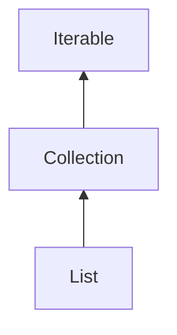

# List依赖
List的依赖关系简单版，没有表明实现，因为目前只关注List的方法和源码，List的不同实现有 再做不同的解析



# List源码
```java
/**
 * An ordered collection (also known as a <i>sequence</i>).  
 * 一个有序的集合
 * The user of this interface has precise control over where in the list each element is inserted.  
 * 该这个接口可以精确控制每个元素在列表中的插入位置
 * 
 * The user can access elements by their integer index (position in the list), and search for elements in the list.
 * 用户可以通过索引位置获取list中的元素
 * 
 * Unlike sets, lists typically allow duplicate elements.  
 * 与sets不同，lists可以放入重复的元素
 * More formally, lists typically allow pairs of elements 
 * 更正式地说，列表通常允许成对的元素
 * e1 and e2 such that e1.equals(e2), 
 * and they typically allow multiple null elements if they allow null elements at all.  
 * 并且它们通常允许多个null元素，如果它们允许null元素
 * 
 * It is not inconceivable that someone might wish to implement a list that prohibits duplicates, by
 * throwing runtime exceptions when the user attempts to insert them, but we expect this usage to be rare.
 *
 * The List interface places additional stipulations, beyond those
 * specified in the Collection interface, on the contracts of the
 * iterator, add, remove, equals, and
 * hashCode methods.  
 * List接口在Collection接口规定的基础上，对iterator、add、remove、equals和hashCode方法添加了额外的实现
 * 
 * Declarations for other inherited methods are also included here for convenience.
 * 为了方便起见，这里还包含了其他继承方法的声明。
 * 
 * The List interface provides four methods for positional (indexed) access to list elements.  
 * List 提供了四种通过index进行元素访问的方法
 * 
 * Lists (like Java arrays) are zero based. 
 * List是从0开始索引
 * 
 * Note
 * that these operations may execute in time proportional to the index value
 * for some implementations (the LinkedList class, for example). 
 * 这些操作可能执行的时间与索引值成正比：这意味着对于某些实现（例如LinkedList类），访问列表中特定位置的元素（通过索引）的时间可能随着索引值的增加而增加。
 * 这是因为某些数据结构（如链表）访问中间元素可能需要更多的时间，而数组或某些其他数据结构则可以在恒定时间内访问任意元素
 * 
 * Thus, iterating over the elements in a list is typically preferable to indexing through it if the caller does not know the implementation.
 * 因此，通常更喜欢遍历列表元素而不是通过索引访问：这是基于上述性能考虑的建议。
 * 如果调用者不知道列表的具体实现类型，遍历列表元素通常是一个更好的选择，因为它避免了与索引值相关的性能问题。
 *
 * The List interface provides a special iterator, called a ListIterator, 
 * that allows element insertion and replacement, and bidirectional access in addition to the normal operations that the
 * Iterator interface provides.  A method is provided to obtain a
 * list iterator that starts at a specified position in the list.
 * List接口提供的特殊迭代器，称为ListIterator。与标准的Iterator接口相比，ListIterator允许在列表中插入和替换元素，并提供双向访问。
 * 这意味着你可以从列表的前面和后面遍历元素。此外，还提供了一个方法来获取从列表中特定位置开始迭代的ListIterator
 *
 * The List interface provides two methods to search for a specified object.  
 * From a performance standpoint, these methods should be used with caution. 
 * In many implementations they will perform costly linear searches.
 * 尽管List接口提供了搜索方法，但在某些实现中，这些方法可能会导致较低的性能，因为它们采用线性搜索方式。在处理大量数据时，使用其他更高效的搜索算法或数据结构可能更为合适。
 *
 * The List interface provides two methods to efficiently insert and
 * remove multiple elements at an arbitrary point in the list.
 * List接口提供了两种方法来有效地插入和删除列表中任意点的多个元素
 *
 * Note: While it is permissible for lists to contain themselves as elements,
 * extreme caution is advised: the equals and hashCode
 * methods are no longer well defined on such a list.
 * 虽然允许列表将其自身作为元素包含，但应极其谨慎行事。对于这样一个列表，equals和hashCode方法不再有明确定义
 *
 * Some list implementations have restrictions on the elements that they may contain. 
 * 一些列表实现对它们可能包含的元素有限制。
 * 
 * For example, some implementations prohibit null elements, and some have restrictions on the types of their elements.
 * 例如，有些实现禁止null元素，有些实现对其元素的类型有限制。
 * 
 * Attempting to add an ineligible element throws an unchecked exception, typically
 * NullPointerException or ClassCastException.  
 * 尝试添加不合格的元素会抛出一个未检查的异常，通常是NullPointerException或ClassCastException
 * 
 * Attempting to query the presence of an ineligible element may throw an exception, or it may simply return false; 
 * 尝试查询不合格元素的存在的行为可能会抛出异常，或者简单地返回false；
 * 
 * some implementations will exhibit the former behavior and some will exhibit the latter.  
 * 某些实现会表现出前一种行为，而其他实现则表现出后一种行为
 * 
 * More generally, attempting an operation on an ineligible element whose completion would not result in
 * the insertion of an ineligible element into the list may throw an
 * exception or it may succeed, at the option of the implementation.
 * 更一般地说，对不合格元素的尝试操作，如果其完成不会导致不合格元素被插入到列表中，可能会抛出异常，也可能会成功，这取决于实现的选择。
 * 
 * Such exceptions are marked as "optional" in the specification for this interface.
 * 此类异常在接口规范中被标记为“可选”。
 *

 *
 * @param <E> the type of elements in this list
 *
 * @author  Josh Bloch
 * @author  Neal Gafter
 * @see Collection
 * @see Set
 * @see ArrayList
 * @see LinkedList
 * @see Vector
 * @see Arrays#asList(Object[])
 * @see Collections#nCopies(int, Object)
 * @see Collections#EMPTY_LIST
 * @see AbstractList
 * @see AbstractSequentialList
 * @since 1.2
 */

public interface List<E> extends Collection<E> {
    // 查询操作

    /**
     * Returns the number of elements in this list.  
     * 返回List中的元素数量
     * 
     * If this list contains more than Integer.MAX_VALUE elements, returns
     * Integer.MAX_VALUE.
     * 如果元素数量大于Integer最大值，返回Integer最大值
     *
     * @return the number of elements in this list
     */
    int size();

    /**
     * Returns true if this list contains no elements.
     * 当List中没有元素时，返回true
     *
     * @return true if this list contains no elements
     */
    boolean isEmpty();

    /**
     * Returns true if this list contains the specified element.
     * 如果List存在元素o，则返回true
     * 
     * More formally, returns true if and only if this list contains at least one element e 
     * such that
     * 通过下面的表达式来计算是否相等
     * (o==null ? e==null : o.equals(e)).
     *
     * @param o element whose presence in this list is to be tested
     * @return true if this list contains the specified element
     * @throws ClassCastException if the type of the specified element
     *         is incompatible with this list
     * (<a href="Collection.html#optional-restrictions">optional</a>)
     * @throws NullPointerException if the specified element is null and this
     *         list does not permit null elements
     * (<a href="Collection.html#optional-restrictions">optional</a>)
     */
    boolean contains(Object o);

    /**
     * Returns an iterator over the elements in this list in proper sequence.
     * 按正确的顺序在此列表中的元素上返回迭代器。
     *
     * @return an iterator over the elements in this list in proper sequence
     */
    Iterator<E> iterator();

    /**
     * Returns an array containing all of the elements in this list in proper sequence (from first to last element).
     * 返回一个数组，该数组包含此列表中的所有元素序列（从第一个元素到最后一个元素）。
     *
     * The returned array will be "safe" in that no references to it are
     * maintained by this list.  (In other words, this method must
     * allocate a new array even if this list is backed by an array).
     * The caller is thus free to modify the returned array.
     * 返回的数组是“安全的”，因为没有对它的引用由该列表维护。（换句话说，此方法必须即使该列表由数组支持，也要分配新的数组）.因此，调用者可以自由地修改返回的数组。
     *
     * This method acts as bridge between array-based and collection-based
     * APIs.
     * 此方法充当基于数组和基于集合之间的桥梁API。
     *
     * @return an array containing all of the elements in this list in proper
     *         sequence
     * @see Arrays#asList(Object[])
     */
    Object[] toArray();

    /**
     * Returns an array containing all of the elements in this list in proper sequence (from first to last element); 
     * 返回一个数组，该数组包含此列表中的所有元素序列（从第一个元素到最后一个元素）。
     * 
     * the runtime type of the returned array is that of the specified array.  
     * 返回的数组的类型是指定数组的类型
     * 
     * If the list fits in the specified array, it is returned therein.  
     * 如果列表能够完全容纳在指定数组中，则直接在该数组内返回
     * 
     * Otherwise, a new array is allocated with the runtime type of the specified array and the size of this list.
     * 否则，将根据指定数组的运行时类型和当前列表的实际大小分配一个新的数组
     * 
     * If the list fits in the specified array with room to spare (i.e., the array has more elements than the list), 
     * 若列表恰好能够装入指定数组且数组还有剩余空间（即数组元素数量大于列表元素）
     * 
     * the element in the array immediately following the end of the list is set to null.
     * 则列表末尾之后紧跟的数组元素会被设置为 null
     * 
     * (This is useful in determining the length of the list <i>only</i> if the caller knows that the list does not contain any null elements.)
     * 这有助于在某些情况下（特别是调用者明确知道列表不包含 null 元素时），通过检查数组中的第一个 null 来快速确定列表的实际长度。
     * 
     * Like the {@link #toArray()} method, this method acts as bridge between array-based and collection-based APIs.  
     * 此方法类似于 toArray() 方法，起到了连接基于数组和基于集合API之间的桥梁作用
     * 
     * Further, this method allows precise control over the runtime type of the output array, and may, under certain circumstances, be used to save allocation costs.
     * 此外，该方法允许对输出数组的运行时类型进行精确控制，并且在某些情况下可以用于节省分配成本。
     *
     * Suppose x is a list known to contain only strings.
     * The following code can be used to dump the list into a newly
     * allocated array of String:
     *
     * 举例：
     * <pre>{@code
     *     String[] y = x.toArray(new String[0]);
     * }</pre>
     *
     * Note that toArray(new Object[0]) is identical in function to
     * toArray().
     * toArray(new Object[0])方法和toArray()方法是等效的
     *
     * @param a the array into which the elements of this list are to
     *          be stored, if it is big enough; otherwise, a new array of the
     *          same runtime type is allocated for this purpose.
     * @return an array containing the elements of this list
     * @throws ArrayStoreException if the runtime type of the specified array
     *         is not a supertype of the runtime type of every element in
     *         this list
     * @throws NullPointerException if the specified array is null
     */
    <T> T[] toArray(T[] a);


    // Modification Operations

    /**
     * Appends the specified element to the end of this list (optional operation).
     * 在List的结尾添加元素
     *
     * Lists that support this operation may place limitations on what elements may be added to this list. 
     * 支持此操作的列表，可能会限制哪些元素可以添加到此列表里面
     *
     * In particular, some lists will refuse to add null elements, 
     * 特别需要注意的是，某些列表会拒绝添加 null 元素，也就是说在这些列表中插入 null 值的操作将不被允许。
     * 
     * and others will impose restrictions on the type of elements that may be added. 
     * 另外，还有一些列表会对可添加元素的类型施加特定的限制，即只允许特定类型的对象加入到列表中
     * 
     * List classes should clearly specify in their documentation any restrictions on what elements may be added.
     * 任何实现 List 接口的类，在其文档中都应当清楚地指出对添加元素有哪些限制条件。这是因为不同的 List 类可能会有不同的约束
     *
     * @param e element to be appended to this list
     * @return true (as specified by {@link Collection#add})
     * @throws UnsupportedOperationException if the add operation
     *         is not supported by this list
     * @throws ClassCastException if the class of the specified element
     *         prevents it from being added to this list
     * @throws NullPointerException if the specified element is null and this
     *         list does not permit null elements
     * @throws IllegalArgumentException if some property of this element
     *         prevents it from being added to this list
     */
    boolean add(E e);

    /**
     * Removes the first occurrence of the specified element from this list, if it is present (optional operation). 
     * 从列表中移除首次出现的指定元素。如果该元素存在于列表中，则将其从列表中移除；
     * 
     * If this list does not contain the element, it is unchanged.  
     * 若列表中不存在此元素，则不进行任何操作
     * 
     * More formally, removes the element with the lowest index i such that (o==null ? get(i)==null : o.equals(get(i))) 
     * (if such an element exists).  
     * 通常，这个方法将会移除最低的索引的元素
     * 
     * Returns true if this list contained the specified element (or equivalently, if this list changed as a result of the call).
     * 如果此列表原本包含指定的元素，或者换句话说，如果由于这次调用导致列表的内容发生了变化，将会返回true
     *
     * @param o element to be removed from this list, if present
     * @return true if this list contained the specified element
     * @throws ClassCastException if the type of the specified element
     *         is incompatible with this list
     * (<a href="Collection.html#optional-restrictions">optional</a>)
     * @throws NullPointerException if the specified element is null and this
     *         list does not permit null elements
     * (<a href="Collection.html#optional-restrictions">optional</a>)
     * @throws UnsupportedOperationException if the remove operation
     *         is not supported by this list
     */
    boolean remove(Object o);


    // Bulk Modification Operations 批量修改操作

    /**
     * Returns true if this list contains all of the elements of the specified collection.
     * 如果此列表包含指定集合的所有元素，则返回true。
     *
     * @param  c collection to be checked for containment in this list
     * @return true if this list contains all of the elements of the
     *         specified collection
     * @throws ClassCastException if the types of one or more elements
     *         in the specified collection are incompatible with this
     *         list
     * (<a href="Collection.html#optional-restrictions">optional</a>)
     * @throws NullPointerException if the specified collection contains one
     *         or more null elements and this list does not permit null
     *         elements
     *         (<a href="Collection.html#optional-restrictions">optional</a>),
     *         or if the specified collection is null
     * @see #contains(Object)
     */
    boolean containsAll(Collection<?> c);

    /**
     * Appends all of the elements in the specified collection to the end of
     * this list, in the order that they are returned by the specified
     * collection's iterator (optional operation).  
     * 将指定集合中的所有元素追加到的末尾该列表，按指定的返回顺序集合的迭代器（可选操作）。
     * 
     * The behavior of this operation is undefined if the specified collection is modified while the operation is in progress.  
     * (Note that this will occur if the specified collection is this list, and it's nonempty.)
     * 在添加的过程中，如果集合发生变化，可能导致不能预期的结果
     *
     * @param c collection containing elements to be added to this list
     * @return true if this list changed as a result of the call
     * @throws UnsupportedOperationException if the addAll operation
     *         is not supported by this list
     * @throws ClassCastException if the class of an element of the specified
     *         collection prevents it from being added to this list
     * @throws NullPointerException if the specified collection contains one
     *         or more null elements and this list does not permit null
     *         elements, or if the specified collection is null
     * @throws IllegalArgumentException if some property of an element of the
     *         specified collection prevents it from being added to this list
     * @see #add(Object)
     */
    boolean addAll(Collection<? extends E> c);

    /**
     * Inserts all of the elements in the specified collection into this list at the specified position (optional operation).  
     * 在指定位置将指定集合中的所有元素插入此列表（可选操作）
     * 
     * Shifts the element currently at that position (if any) and any subsequent elements to the right (increases their indices).  
     * 将当前位于该位置的元素（如果有）和任何后续元素向右移动（增加它们的索引）。
     * 
     * The new elements will appear in this list in the order that they are returned by the specified collection's iterator.  
     * 新元素将按指定集合的迭代器返回的顺序显示在此列表中。
     * 
     * The behavior of this operation is undefined if the specified collection is modified while the operation is in progress.  
     * (Note that this will occur if the specified collection is this list, and it's nonempty.)
     * 在添加的过程中，如果集合发生变化，可能导致不能预期的结果
     * 
     * @param index index at which to insert the first element from the
     *              specified collection
     * @param c collection containing elements to be added to this list
     * @return true if this list changed as a result of the call
     * @throws UnsupportedOperationException if the addAll operation
     *         is not supported by this list
     * @throws ClassCastException if the class of an element of the specified
     *         collection prevents it from being added to this list
     * @throws NullPointerException if the specified collection contains one
     *         or more null elements and this list does not permit null
     *         elements, or if the specified collection is null
     * @throws IllegalArgumentException if some property of an element of the
     *         specified collection prevents it from being added to this list
     * @throws IndexOutOfBoundsException if the index is out of range
     *         (index &lt; 0 || index &gt; size())
     */
    boolean addAll(int index, Collection<? extends E> c);

    /**
     * Removes from this list all of its elements that are contained in the specified collection (optional operation).
     * 从此列表中删除指定集合中包含的所有元素（可选操作）。
     *
     * @param c collection containing elements to be removed from this list
     * @return true if this list changed as a result of the call
     * @throws UnsupportedOperationException if the removeAll operation
     *         is not supported by this list
     * @throws ClassCastException if the class of an element of this list
     *         is incompatible with the specified collection
     * (<a href="Collection.html#optional-restrictions">optional</a>)
     * @throws NullPointerException if this list contains a null element and the
     *         specified collection does not permit null elements
     *         (<a href="Collection.html#optional-restrictions">optional</a>),
     *         or if the specified collection is null
     * @see #remove(Object)
     * @see #contains(Object)
     */
    boolean removeAll(Collection<?> c);

    /**
     * Retains only the elements in this list that are contained in the specified collection (optional operation).  
     * 仅保留此列表中包含在指定集合中的元素（可选操作）。
     * 
     * In other words, removes from this list all of its elements that are not contained in the specified collection.
     * 换句话说，从该列表中删除指定集合中未包含的所有元素。
     *
     * @param c collection containing elements to be retained in this list
     * @return true if this list changed as a result of the call
     * @throws UnsupportedOperationException if the retainAll operation
     *         is not supported by this list
     * @throws ClassCastException if the class of an element of this list
     *         is incompatible with the specified collection
     * (<a href="Collection.html#optional-restrictions">optional</a>)
     * @throws NullPointerException if this list contains a null element and the
     *         specified collection does not permit null elements
     *         (<a href="Collection.html#optional-restrictions">optional</a>),
     *         or if the specified collection is null
     * @see #remove(Object)
     * @see #contains(Object)
     */
    boolean retainAll(Collection<?> c);

    /**
     * Replaces each element of this list with the result of applying the operator to that element.  
     * 将此列表中的每个元素替换为对该元素应用运算符的结果。
     * 
     * Errors or runtime exceptions thrown by the operator are relayed to the caller.
     *
     * @implSpec
     * The default implementation is equivalent to, for this {@code list}:
     * <pre>{@code
     *     final ListIterator<E> li = list.listIterator();
     *     while (li.hasNext()) {
     *         li.set(operator.apply(li.next()));
     *     }
     * }</pre>
     *
     * If the list's list-iterator does not support the {@code set} operation
     * then an {@code UnsupportedOperationException} will be thrown when
     * replacing the first element.
     *
     * @param operator the operator to apply to each element
     * @throws UnsupportedOperationException if this list is unmodifiable.
     *         Implementations may throw this exception if an element
     *         cannot be replaced or if, in general, modification is not
     *         supported
     * @throws NullPointerException if the specified operator is null or
     *         if the operator result is a null value and this list does
     *         not permit null elements
     *         (<a href="Collection.html#optional-restrictions">optional</a>)
     * @since 1.8
     */
    default void replaceAll(UnaryOperator<E> operator) {
        Objects.requireNonNull(operator);
        final ListIterator<E> li = this.listIterator();
        while (li.hasNext()) {
            li.set(operator.apply(li.next()));
        }
    }

    /**
     * Sorts this list according to the order induced by the specified {@link Comparator}.
     * 根据指定的比较器对此列表进行排序
     *
     * All elements in this list must be <i>mutually comparable</i> using the specified comparator 
     * (that is, {@code c.compare(e1, e2)} must not throw a {@code ClassCastException} for any elements {@code e1} and {@code e2} in the list).
     * 所有的元素必须是可比较的，对于列表中的任意两个元素 e1 和 e2，调用比较器 c.compare(e1, e2) 不应该抛出 ClassCastException 异常
     * 
     * If the specified comparator is {@code null} then all elements in this list must implement the {@link Comparable} interface and the elements' {@linkplain Comparable natural ordering} should be used.
     * 如果指定的比较器为null，则集合或列表中的所有元素都必须实现Comparable接口。这意味着这些元素需要具有自然排序的能力，即它们需要提供自身的比较逻辑，这样可以通过调用每个元素的compareTo()方法来确定元素之间的相对顺序。
     *
     * This list must be modifiable, but need not be resizable.
     * 这个列表必须是可修改的，但不一定需要可调整大小
     *
     * @implSpec
     * The default implementation obtains an array containing all elements in
     * this list, sorts the array, and iterates over this list resetting each
     * element from the corresponding position in the array. (This avoids the
     * n<sup>2</sup> log(n) performance that would result from attempting
     * to sort a linked list in place.)
     * 1、默认情况下，该方法首先将列表中的所有元素放入一个数组中，然后对数组进行排序。
     * 2、排序完成后，遍历原列表并将每个元素从排序后的数组中对应的位置重新赋值。这样做避免了试图在链表结构上就地排序所导致的n²log(n)时间复杂度问题。
     *
     * @implNote
     * This implementation is a stable, adaptive, iterative mergesort that
     * requires far fewer than n lg(n) comparisons when the input array is
     * partially sorted, while offering the performance of a traditional
     * mergesort when the input array is randomly ordered.  If the input array
     * is nearly sorted, the implementation requires approximately n
     * comparisons.  Temporary storage requirements vary from a small constant
     * for nearly sorted input arrays to n/2 object references for randomly
     * ordered input arrays.
     * 
     * 该实现采用了一种稳定的、自适应的、迭代归并排序算法。当输入数组部分有序时，它所需要的比较次数远少于n * log(n)次。在处理随机排序的输入数组时，其性能表现与传统的归并排序相当。
     * 对于接近有序的输入数组，此实现大约仅需要n次比较操作就能完成排序。同时，它的临时存储需求会根据输入数组的排序状况动态变化：
     * 对于近乎有序的输入数组，所需的临时空间非常小且为常量；而对于随机排列的输入数组，最多可能需要n/2个对象引用的空间作为临时存储。
     *
     * The implementation takes equal advantage of ascending and
     * descending order in its input array, and can take advantage of
     * ascending and descending order in different parts of the same
     * input array.  It is well-suited to merging two or more sorted arrays:
     * simply concatenate the arrays and sort the resulting array.
     * 该排序实现能够充分利用输入数组中的升序和降序特性，无论在数组的同一部分还是不同部分存在升序或降序，都能高效地进行处理。
     * 这种特性使得它特别适合合并两个或更多已排序的数组：只需要将这些数组连接起来，然后对拼接后的数组进行排序即可。这种算法能够识别并利用原有的有序性，从而在处理部分有序数据时表现出较高的效率。
     * 
     * The implementation was adapted from Tim Peters's list sort for Python
     * (<a href="http://svn.python.org/projects/python/trunk/Objects/listsort.txt">
     * TimSort</a>).  It uses techniques from Peter McIlroy's "Optimistic
     * Sorting and Information Theoretic Complexity", in Proceedings of the
     * Fourth Annual ACM-SIAM Symposium on Discrete Algorithms, pp 467-474,
     * January 1993.
     * 该算法实现来源于Tim Peters为Python编写的列表排序算法（即TimSort），
     * 并借鉴了Peter McIlroy在1993年第四届ACM-SIAM离散算法研讨会论文《Optimistic Sorting and Information Theoretic Complexity》中的技术思想。
     *
     * @param c the {@code Comparator} used to compare list elements.
     *          A {@code null} value indicates that the elements'
     *          {@linkplain Comparable natural ordering} should be used
     * @throws ClassCastException if the list contains elements that are not
     *         <i>mutually comparable</i> using the specified comparator
     * @throws UnsupportedOperationException if the list's list-iterator does
     *         not support the {@code set} operation
     * @throws IllegalArgumentException
     *         (<a href="Collection.html#optional-restrictions">optional</a>)
     *         if the comparator is found to violate the {@link Comparator}
     *         contract
     * @since 1.8
     */
    @SuppressWarnings({"unchecked", "rawtypes"})
    default void sort(Comparator<? super E> c) {
        Object[] a = this.toArray();
        Arrays.sort(a, (Comparator) c);
        ListIterator<E> i = this.listIterator();
        for (Object e : a) {
            i.next();
            i.set((E) e);
        }
    }

    /**
     * Removes all of the elements from this list (optional operation).
     * 移除List中的所有元素
     *
     * The list will be empty after this call returns.
     * 执行这个方法后这个List会变成empty
     *
     * @throws UnsupportedOperationException if the clear operation
     *         is not supported by this list
     */
    void clear();


    // Comparison and hashing

    /**
     * Compares the specified object with this list for equality.  
     * 判断指定对象与当前列表是否相等。
     * 
     * Returns true if and only 
     * if the specified object is also a list, 
     * 1.指定的对象也是一个列表（List）。
     * both lists have the same size, 
     * 2.两个列表的大小（元素个数）相同。
     * and all corresponding pairs of elements in e2 are <i>equal</i> if (e1==null ? e2==null : e1.equals(e2)).)  
     * 对于两个列表中的每一对对应位置的元素，它们要么都是null，要么都通过equals()方法比较结果为true。
     * 
     * In other words, two lists are defined to be equal if they contain the same elements in the same order.
     * 换句话说，如果两个列表以相同的顺序包含相同的元素，则它们被定义为相等。
     * 
     * This definition ensures that the equals method works properly across different implementations of the List interface.
     * 这样的定义确保了equals()方法在不同List接口实现之间的一致性和正确性
     * 
     * @param o the object to be compared for equality with this list
     * @return true if the specified object is equal to this list
     */
    boolean equals(Object o);

    /**
     * Returns the hash code value for this list.  The hash code of a list
     * is defined to be the result of the following calculation:
     * <pre>{@code
     *     int hashCode = 1;
     *     for (E e : list)
     *         hashCode = 31*hashCode + (e==null ? 0 : e.hashCode());
     * }</pre>
     * This ensures that list1.equals(list2) implies that
     * list1.hashCode()==list2.hashCode() for any two lists,
     * list1 and list2, as required by the general
     * contract of {@link Object#hashCode}.
     *
     * @return the hash code value for this list
     * @see Object#equals(Object)
     * @see #equals(Object)
     */
    int hashCode();


    // Positional Access Operations

    /**
     * Returns the element at the specified position in this list.
     *
     * @param index index of the element to return
     * @return the element at the specified position in this list
     * @throws IndexOutOfBoundsException if the index is out of range
     *         (index &lt; 0 || index &gt;= size())
     */
    E get(int index);

    /**
     * Replaces the element at the specified position in this list with the
     * specified element (optional operation).
     *
     * @param index index of the element to replace
     * @param element element to be stored at the specified position
     * @return the element previously at the specified position
     * @throws UnsupportedOperationException if the set operation
     *         is not supported by this list
     * @throws ClassCastException if the class of the specified element
     *         prevents it from being added to this list
     * @throws NullPointerException if the specified element is null and
     *         this list does not permit null elements
     * @throws IllegalArgumentException if some property of the specified
     *         element prevents it from being added to this list
     * @throws IndexOutOfBoundsException if the index is out of range
     *         (index &lt; 0 || index &gt;= size())
     */
    E set(int index, E element);

    /**
     * Inserts the specified element at the specified position in this list
     * (optional operation).  Shifts the element currently at that position
     * (if any) and any subsequent elements to the right (adds one to their
     * indices).
     *
     * @param index index at which the specified element is to be inserted
     * @param element element to be inserted
     * @throws UnsupportedOperationException if the add operation
     *         is not supported by this list
     * @throws ClassCastException if the class of the specified element
     *         prevents it from being added to this list
     * @throws NullPointerException if the specified element is null and
     *         this list does not permit null elements
     * @throws IllegalArgumentException if some property of the specified
     *         element prevents it from being added to this list
     * @throws IndexOutOfBoundsException if the index is out of range
     *         (index &lt; 0 || index &gt; size())
     */
    void add(int index, E element);

    /**
     * Removes the element at the specified position in this list (optional
     * operation).  Shifts any subsequent elements to the left (subtracts one
     * from their indices).  Returns the element that was removed from the
     * list.
     *
     * @param index the index of the element to be removed
     * @return the element previously at the specified position
     * @throws UnsupportedOperationException if the remove operation
     *         is not supported by this list
     * @throws IndexOutOfBoundsException if the index is out of range
     *         (index &lt; 0 || index &gt;= size())
     */
    E remove(int index);


    // Search Operations

    /**
     * Returns the index of the first occurrence of the specified element
     * in this list, or -1 if this list does not contain the element.
     * More formally, returns the lowest index i such that
     * (o==null ? get(i)==null : o.equals(get(i))),
     * or -1 if there is no such index.
     *
     * @param o element to search for
     * @return the index of the first occurrence of the specified element in
     *         this list, or -1 if this list does not contain the element
     * @throws ClassCastException if the type of the specified element
     *         is incompatible with this list
     *         (<a href="Collection.html#optional-restrictions">optional</a>)
     * @throws NullPointerException if the specified element is null and this
     *         list does not permit null elements
     *         (<a href="Collection.html#optional-restrictions">optional</a>)
     */
    int indexOf(Object o);

    /**
     * Returns the index of the last occurrence of the specified element
     * in this list, or -1 if this list does not contain the element.
     * More formally, returns the highest index i such that
     * (o==null ? get(i)==null : o.equals(get(i))),
     * or -1 if there is no such index.
     *
     * @param o element to search for
     * @return the index of the last occurrence of the specified element in
     *         this list, or -1 if this list does not contain the element
     * @throws ClassCastException if the type of the specified element
     *         is incompatible with this list
     *         (<a href="Collection.html#optional-restrictions">optional</a>)
     * @throws NullPointerException if the specified element is null and this
     *         list does not permit null elements
     *         (<a href="Collection.html#optional-restrictions">optional</a>)
     */
    int lastIndexOf(Object o);


    // List Iterators

    /**
     * Returns a list iterator over the elements in this list (in proper
     * sequence).
     *
     * @return a list iterator over the elements in this list (in proper
     *         sequence)
     */
    ListIterator<E> listIterator();

    /**
     * Returns a list iterator over the elements in this list (in proper
     * sequence), starting at the specified position in the list.
     * The specified index indicates the first element that would be
     * returned by an initial call to {@link ListIterator#next next}.
     * An initial call to {@link ListIterator#previous previous} would
     * return the element with the specified index minus one.
     *
     * @param index index of the first element to be returned from the
     *        list iterator (by a call to {@link ListIterator#next next})
     * @return a list iterator over the elements in this list (in proper
     *         sequence), starting at the specified position in the list
     * @throws IndexOutOfBoundsException if the index is out of range
     *         ({@code index < 0 || index > size()})
     */
    ListIterator<E> listIterator(int index);

    // View

    /**
     * Returns a view of the portion of this list between the specified
     * fromIndex, inclusive, and toIndex, exclusive.  (If
     * fromIndex and toIndex are equal, the returned list is
     * empty.)  The returned list is backed by this list, so non-structural
     * changes in the returned list are reflected in this list, and vice-versa.
     * The returned list supports all of the optional list operations supported
     * by this list.
     *
     * This method eliminates the need for explicit range operations (of
     * the sort that commonly exist for arrays).  Any operation that expects
     * a list can be used as a range operation by passing a subList view
     * instead of a whole list.  For example, the following idiom
     * removes a range of elements from a list:
     * <pre>{@code
     *      list.subList(from, to).clear();
     * }</pre>
     * Similar idioms may be constructed for indexOf and
     * lastIndexOf, and all of the algorithms in the
     * Collections class can be applied to a subList.
     *
     * The semantics of the list returned by this method become undefined if
     * the backing list (i.e., this list) is <i>structurally modified</i> in
     * any way other than via the returned list.  (Structural modifications are
     * those that change the size of this list, or otherwise perturb it in such
     * a fashion that iterations in progress may yield incorrect results.)
     *
     * @param fromIndex low endpoint (inclusive) of the subList
     * @param toIndex high endpoint (exclusive) of the subList
     * @return a view of the specified range within this list
     * @throws IndexOutOfBoundsException for an illegal endpoint index value
     *         (fromIndex &lt; 0 || toIndex &gt; size ||
     *         fromIndex &gt; toIndex)
     */
    List<E> subList(int fromIndex, int toIndex);

    /**
     * Creates a {@link Spliterator} over the elements in this list.
     *
     * The {@code Spliterator} reports {@link Spliterator#SIZED} and
     * {@link Spliterator#ORDERED}.  Implementations should document the
     * reporting of additional characteristic values.
     *
     * @implSpec
     * The default implementation creates a
     * <em><a href="Spliterator.html#binding">late-binding</a></em> spliterator
     * from the list's {@code Iterator}.  The spliterator inherits the
     * <em>fail-fast</em> properties of the list's iterator.
     *
     * @implNote
     * The created {@code Spliterator} additionally reports
     * {@link Spliterator#SUBSIZED}.
     *
     * @return a {@code Spliterator} over the elements in this list
     * @since 1.8
     */
    @Override
    default Spliterator<E> spliterator() {
        return Spliterators.spliterator(this, Spliterator.ORDERED);
    }
}

```